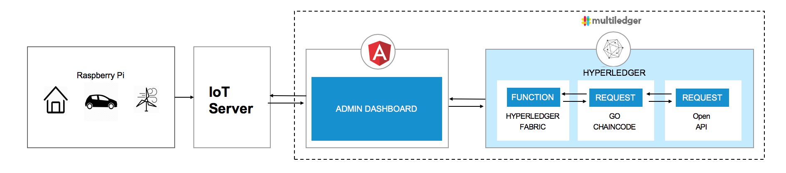

# UBX ENERGY MARKETPLACE

<div style='border: 2px solid #f00;'>
  
</div>
</br>

A key application of Blockchain being currently explored is a Decentralized Energy network. The idea stems from a neighborhood marketplace, employed with a microgrid where certain Prosumers are producing energy through Solar panels or other means, and can sell excess energy to Consumers needing energy. The transactions would be based on tokens in each Resident's account. As per a pre-determined contract and rate, the coins would be debited from the consumer and credited to the producer, for a certain billing period. Each transaction would need to be atomic and added to a Blockchain ledger for trust and verification. The network can also include various green-energy companies who can buy or provide energy through the network.

In this code pattern, we will create such a Blockchain application using Hyperledger Fabric. The network consists of Prosumer and Consumer. Prosumer and Consumer can exchange tokens for energy among each other.  The application assumes a pre-paid system where transactions occur after the energy is consumed and the values are updated.

This code pattern is for developers looking to start building Blockchain applications with Hyperledger Node SDK. When the reader has completed this code pattern, they will understand how to:

* Create a network using Hyperledge Fabric chaincode and recording transactions on Blockchain ledger
* Deploying the network to a service instance of Hyperledger Fabric on Multiledger Platform
* Building an Angular app to interact with the network through REST API
* Connecting a Raspberry Pi device to the network through the app


# Architecture Flow

<p align="center">
  
</p>

1. The administrator interacts with Decentralized Energy UI comprising of Angular framework
2. The IoT device (Raspberry Pi) signals energy generation and transaction to the application
3. The application processes user requests to the network through a REST API
4. Implements requests to the Blockchain state database on Hyperledger Fabric v1.3
5. The REST API is used to retrieve the state of the database
6. The Angular framework gets the data through GET calls to the REST API

# Included Components

* Hyperledger Fabric on Multiledger Platform
* Raspberry Pi
* Angular Framework


# Running the Application
Follow these steps to setup and run this code pattern. The steps are described in detail below.

## Prerequisite
- Operating Systems: Ubuntu Linux 14.04 / 16.04 LTS (both 64-bit), or Mac OS 10.12
- [npm](https://www.npmjs.com/)  (v5.x)
- [Node](https://nodejs.org/en/) (version 8.9 or higher)
  * to install specific Node version you can use [nvm](https://davidwalsh.name/nvm)
- [Homebrew](https://brew.sh) for Mac OS X installation
- [Hyperledger Fabric on Multiledger Platform](https://multiledger.io)

## Steps
1. [Clone the repo](#1-clone-the-repo)
2. [Configure Chaincode](#2-configure-the-chaincode)
3. [Run Chaincode](#3-run-chaincode)
4. [Call Chaincode from Application](#4-call-chaincode-from-application)
5. [Integrate IoT Device](#5-integrate-iot-device)


## 1. Clone the repo

Clone the `UBX-Energy-Marketplace code` locally. In a terminal, run:

```
git clone https://github.com/multiledger/UBX-Energy-Marketplace
cd UBX-Energy-Marketplace
```


## 2. Configure Chaincode

To explore the Chaincode file, go into the chaincode folder and locate the specific GO file.

```
cd chaincode/energy-blockchain/src
open p2p-energy.go
```

The simplest approach is to define the different messages that will be written to the blockchain as GO structures. Then enrich each structure with JSON tags. (Keep in mind that only those structure fields that start with a capital letter will be marshalled to JSON.) Below is the account structure of Prosumer and Consumer.

```go
type Account struct {
	ID  	   string `json:"id"`
	Name	   string `json:"name"`
	Coins      int    `json:"coins"`
	Token      int    `json:"token"`
}
```

The GO programming language already provides a rich library for transforming structures into JSON payload. Therefore, you can simply include the `encoding/json` package.

To convert a structure to JSON, use the GO function `json.Marshal`.To unpack a JSON string to the structure, use the function `json.Unmarshal`.

After defining the account structure, the first step is to define the genesis block and initiate the chaincode.

```go
type EnergyChainCode struct {
	// use this structure for information that is held (in-memory) within chaincode
	// instance and available over all chaincode calls
}

func main() {
	err := shim.Start(new(EnergyChainCode))
	if err != nil {
		fmt.Printf("Error starting Energy chaincode: %s", err)
	}
}

func (t *EnergyChainCode) Init(stub shim.ChaincodeStubInterface) peer.Response {
	return shim.Success(nil)
}
```

Then, you need to create functions to define specifc data processing method. In the Hyperledger Fabric shim interface, use `Invoke` method to invoke actions that are executed to the Blockchain.

```go
func (t *EnergyChainCode) Invoke(stub shim.ChaincodeStubInterface) peer.Response {

	// Which function is been called?
	function, args := stub.GetFunctionAndParameters()

	// Route call to the correct function
	switch function {
	case "read":
		return t.read(stub, args)
	case "create":
		return t.create(stub, args)
	case "update":
		return t.update(stub, args)
	case "transact":
		return t.transact(stub, args)
	case "delete":
		return t.delete(stub, args)
	case "history":
		return t.history(stub, args)
	default:
		logger.Warningf("Invoke('%s') invalid!", function)
		return shim.Error("Invalid method! Valid methods are 'read|create|update|transact|delete|history'!")
	}
}
```

For further details about the chaincode, please visit the documentation for [Hyperledger Fabric](https://hyperledger-fabric.readthedocs.io/en/release-1.3/).

## 3. Run Chaincode

First, from the Multiledger launch pad dashboard, select your hyperledger project and chaincode tab.

Enter chaincode name, version description and select the chaincode archive, upload and then deploy.

<div style='border: 2px solid #f00;'>
  
</div>
</br>

The `Init()` function is triggered, which allows the chaincode to start initial once-off configuration step.

<div style='border: 2px solid #f00;'>
  
</div>
</br>


## 4. Call Chaincode from Application

To communicate with the REST API of Multiledger Hyperledger Fabric, you need to configure the `actionUrl` with your specific Multiledger service url in `data.service.ts`, located in `angular-app/src/app`. Before any APIs can be called, an authorization step has to be completed. Remember CORS needs to be enabled in order to communiate with the Angular App.


To install the Angular app, go inside the `angular-app` folder, and type below in the terminal. This line will automatically download all dependencies described in the `package.json` file:

```
npm install
```

To launch the app locally:

```
npm run dev
```

The application should now be running at:
`http://localhost:4200`


<div style='border: 2px solid #f00;'>
  
</div>
</br>

Once the application opens, create Prosumer and Consumer and fill in dummy data. You can also execute transaction manually using `Transaction` tab. The Prosumer and Consumer account values will be updated in the dashboard.


## 5. Integrate IoT Device

This application can also integrate IoT device, such as Raspberry Pi, to execute transaction.

To start running your Raspberry Pi and simulate the process of energy generation, simply copy `raspberry-pi.py` inside the `IoT` folder and run it on the Raspberry Pi. Please configure your pin setup and [myjson](https://myjson.com) url (We used my myjson to store transaction data rather than directly calling SAP Hyperledger Service because this service is only internally available in SAP for now, so the application has to be the mid-man between Raspberry Pi and SAP Hyperledger Fabric). 

If you do not have a Raspberry Pi and still wish to simulate the IoT functionality, configure the simple simulator `simulate_pi.py`, and run it from your local machine.

Then, the angular app would automatically capture data post by Raspberry Pi and update blockchain and its dashboard.

<div style='border: 2px solid #f00;'>
  
</div>
</br>

At the end of your session, clean your myjson storage:

```
cd ~/IoT
python reset_pi_server.py
```


## Extending Code Pattern

This application demonstrates a basic idea of a decentralized energy network using Blockchain and can be expanded in several ways:
* Adding specific permissions and participant access
* Creating client-side apps for energy trading
* Setting up real time transactions among participants
* Reading from smart meter and distribute energy more intelligently


## Additional Resources
* [Hyperledger Fabric Docs](http://hyperledger-fabric.readthedocs.io/en/latest/)


## License
[MIT License](LICENSE)
